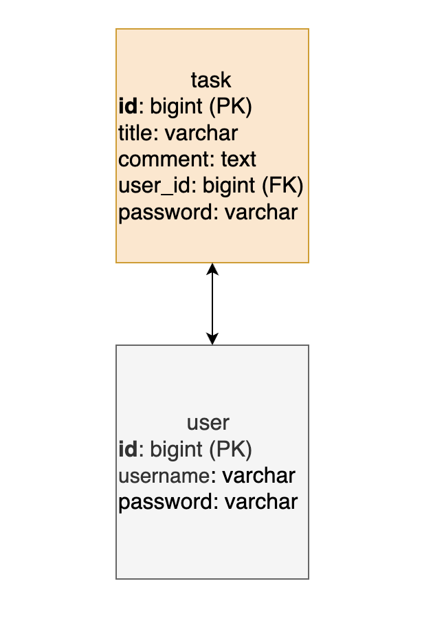

# 📌 Planmate 일정 관리 API

### 간단한 일정 관리 API입니다. 할일을 추가하고, 조회하고, 수정하고, 삭제할 수 있습니다.


## ✅ API 명세

| 메서드 | URL | 설명 | 요청값 예시 | 응답값 예시 | 상태 코드 |
|--------|-----|------|-------------|-------------|-----------|
| POST | /tasks | 일정 생성 | [요청](docs/request-example.json) | [응답](docs/response-example.json) | 201 |
| GET | /tasks | 전체 일정 조회 | - | [응답](docs/response-list.json) | 200 |
| GET | /tasks/search?author=지롱&modifiedDate=2025-03-26 | 조건부 일정 조회 (작성자, 수정일) | - | [응답](docs/response-list.json) | 200 |
| GET | /tasks/{id} | 단일 일정 조회 | - | [응답](docs/response-example.json) | 200 |
| PUT | /tasks/{id} | 일정 수정 | [요청](docs/request-example.json) | [응답](docs/response-example.json) | 200 |
| PATCH | /tasks/{id} | 제목만 수정 | [요청](docs/request-title.json) | [응답](docs/response-example.json) | 200 |
| DELETE | /tasks/{id} | 일정 삭제 | - | 없음 | 204 |

---

## 🗃 ERD
  


---

## 📁 요청 및 응답 JSON 예시

요청 및 응답 예시는 아래 경로에서 확인할 수 있습니다

```
docs/
├── request-example.json
├── request-title.json
├── response-example.json
├── response-list.json
├── erd.png
```


